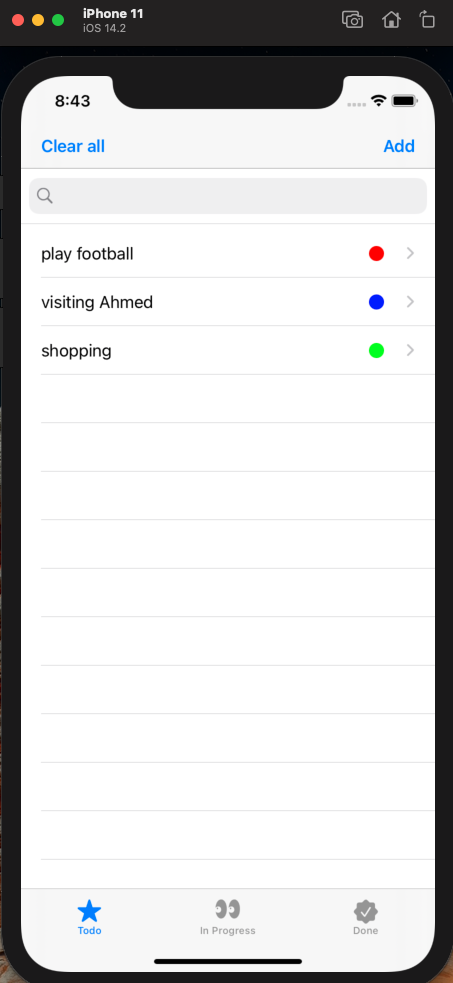
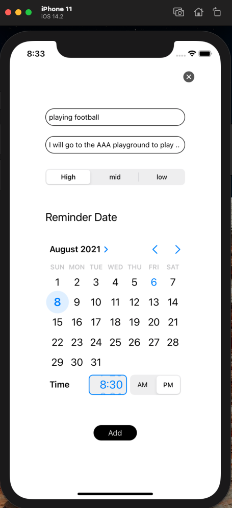
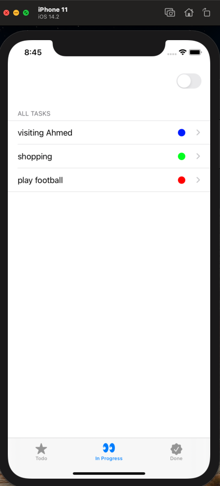
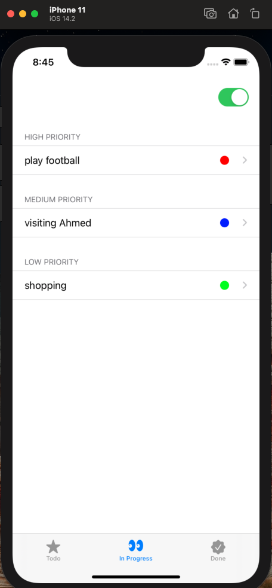
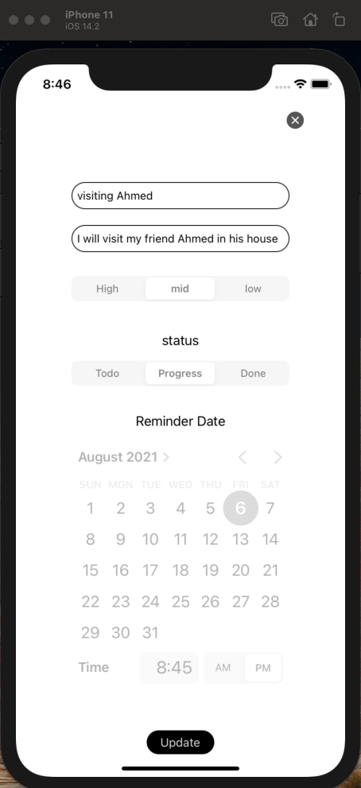
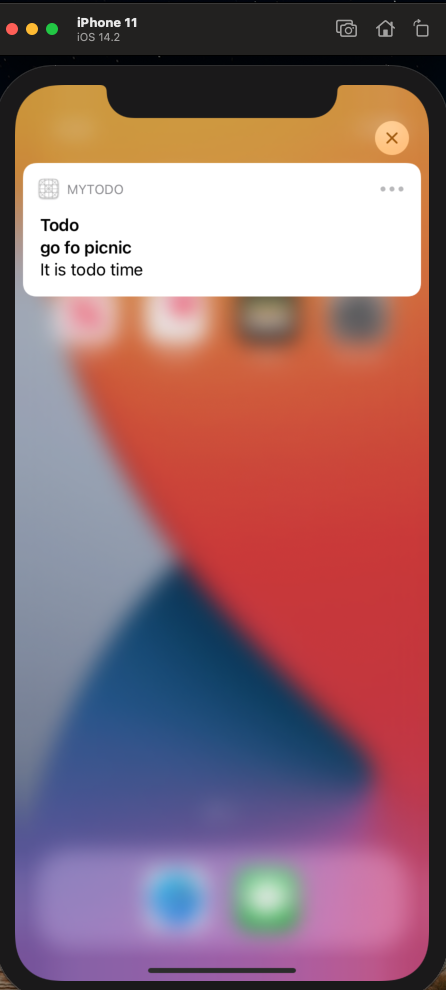

# Todo-App-Objective-C
objective c application 'todo app' with a good user interface and user experience

## screenshoots

All Todoes                                                      |   new Todoe                                               | status all tasks                                            | status filtered  
---                                                             |    ---                                                    | ---                                                         |  ---
         |     |      |       
update                                                          | Notification 
       | 

## Requirements
* Xcode 12.2 at least
* iOS 13+
* Objecive_c
